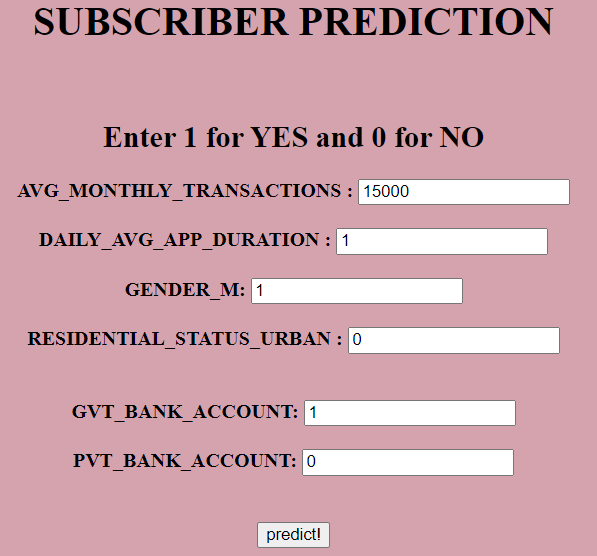
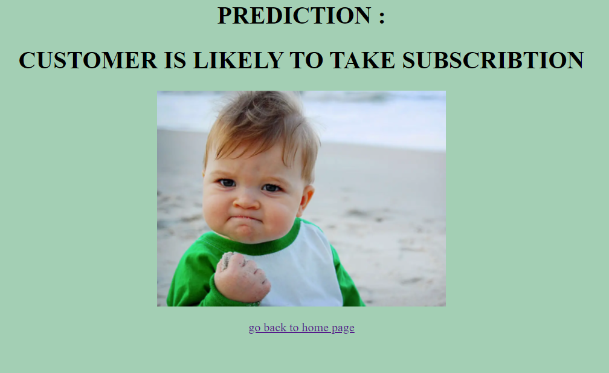
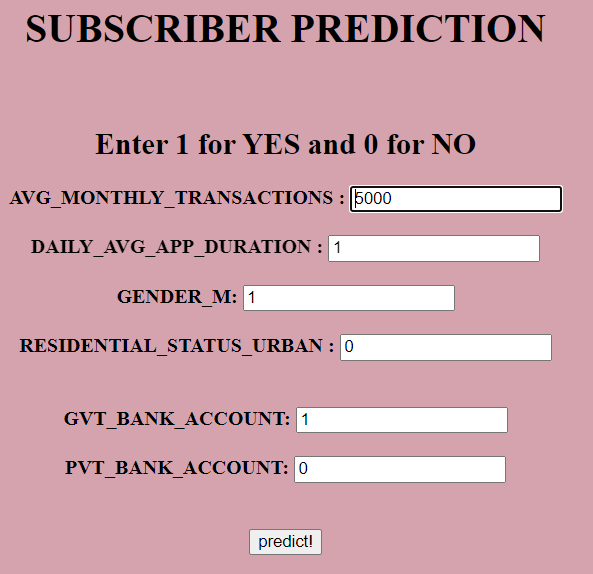
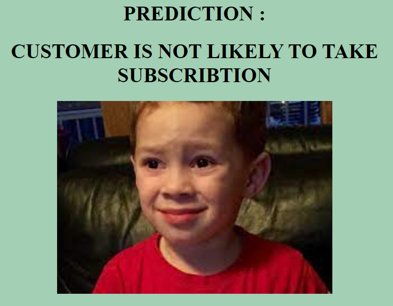

# UPI_SUBSCRIBER_CHURN.
Foreword:
This project deals with the solution to a real world problem faced by UPI payment based fintech companies. 

##Objective :

1. Using Decison Tree algorithm to predict who is more likely to opt in for the upcoming new subscription .

##Problem Statement:

From the above diagram we can understand the communication involved behind every payment.

UPI's have successfully bipassed the banks when it comes to payments in day to day transactions.

But their services are severly effected by bank's poor infrastructure. They can be incentivised by payment apps to upgrade their 

infrastructure.To recover their costs payment apps can introduce a subscription model.This project deals with that scenario where 

a company would want to know if their users are willing to take a subscription.This can be done using the churn data of the 

merchants who have left using the app with the recent government decision to tax payment transactions on merchants using payement 

apps.

Given the rise in volume of transactions a subsription based payment service is not a far fetched idea.

[Reference](https://cleartax.in/s/upi-transaction-charges)

##Dataset: 

The dataset is based on the above the merchants who are still using after the change in goverment policy. If this service is

launched for remaining public.The data from regular users will be of good help to roughly estimate the new subscribers. This model is built on that assumption.

Therefore the Data used here is hypothetical and is built using parameters  that are likely to considered, when and if the service
is to be rolled out to the general customers.

Parameters include in the data CUSTOMER_ID,	GENDER,	AVG_MONTHLY_TRANSACTIONS,DAILY_USAGE_TIME,RESIDENTIAL_STATUS,Bank_type,SUBSCRIPTION_STATUS.

## WOKRING 

Used Decision tree classifier on the data and predicted the churn data. 
(Refer to the notebook file for more.)

Used one hot encoding to handle categorical variables and dropped the first columns to avoid multicollinearity. 

We saved the model in a pickle file as predictionmodel.pkl.

Web app interface is based on 1 and zero for categorial variables. 

Note: There are three categories in bank type and only two columns in the interface.
      So you will get an output when you use two bank types as 0. Implying you selected the 
      third category.

##TEST CASES

## How to Install and Run the Project

1.Clone the repo
2.Create a virtual environment
3.Install Flask
4.Install pickle
5.Install anaconda
6.Run app.py in local server
7.Input the variables and press enter.

